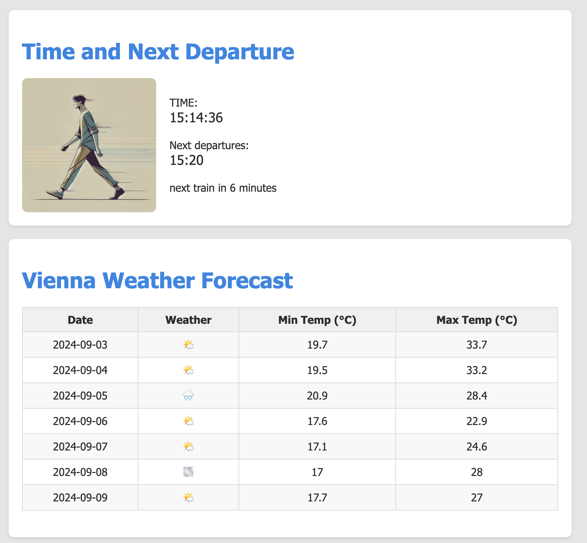

Certainly! Here's an updated version of your README file, including an example section with an image to illustrate how the app looks:

---

# 🌅 Morning Update App

Welcome to the **Morning Update App**! 🌤️ This simple yet elegant Progressive Web App (PWA) is crafted to provide all the essential information I need to start my day right.

Whether I'm wondering if I have time for a leisurely stroll to the tram stop or if I need to dash through the park, this app has me covered. The Morning Update App helps me decide whether to walk or catch the tram to the office—because every minute counts in the morning!

## 🚀 Features

- **Weather Updates:** Get the latest weather information to help me plan the day and the week ahead.
- **Tram Catching Time:** The top card dynamically shows how much time I have to catch the tram:
  - **Relaxed Walk:** Plenty of time to stroll to the tram stop.
  - **Rush:** Need to hurry up to catch the tram!
  - **No Chance:** Unfortunately, I’ll need to consider another option to get to the office.

## 🖼️ Visual Indicators

The top card changes images based on the time situation:

- 🟢 **Walk:** Ample time to enjoy a relaxed walk.
- 🟡 **Rush:** Time to pick up the pace!
- 🔴 **No Chance:** Better find an alternative route.

## 🖼️ Example

Here’s a snapshot of how the app looks:

## 🏗️ Installation

As a PWA, this app is easily installable on your mobile device or desktop. Simply visit the app's GitHub Pages site [here](https://matti88.github.io/homeDashboard/) and add it to your home screen for quick access every morning.

1. **Open the app** in your mobile browser.
2. **Tap the "Add to Home Screen"** prompt to install the app.
3. **Access the app** directly from your home screen, even offline!

## 🛠️ Technologies Used

- **Progressive Web App (PWA):** For a seamless and offline-capable experience.
- **GitHub Pages:** Host the app effortlessly.
- **JavaScript, HTML, CSS:** The foundation of this simple, yet effective app.

## 📝 License

This project is licensed under the MIT License. See the [LICENSE](https://opensource.org/license/mit) file for details.

## 🤝 Just Copy It!

Feel free to clone this repo and adapt this app according to your needs. 

---

This version of the README includes an example section with an image to provide a visual reference of how your app looks. Make sure that the `images/example.png` path is correct and that the image exists in your repository.